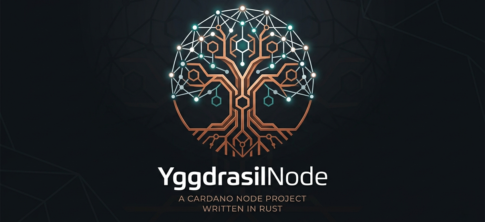

  

# Yggdrasil Node

**Yggdrasil Node** is a dedicated Cardano stake pool operator committed to supporting the decentralization and security of the Cardano blockchain.

## About Us

We run reliable, high-availability Cardano nodes and stake pools on the Cardano network. Our mission is to provide a trustworthy and performant staking service for ADA delegators while contributing to the health and resilience of the Cardano ecosystem.

Named after the great ash tree of Norse mythology that connects the nine worlds, Yggdrasil Node is built on the idea of being a strong, stable, and interconnected part of the Cardano network.

## Our Projects

### 🌐 [Cardano-node](https://github.com/Yggdrasil-node/Cardano-node)

Our primary project — the infrastructure and tooling for running Cardano stake pool nodes. This repository contains:

- Node configuration and setup scripts
- Block-producing and relay node management
- Monitoring and alerting integrations
- Operational guides and documentation

## Getting Involved

We welcome delegators, contributors, and collaborators. Whether you want to stake your ADA with us or contribute to our tooling, we'd love to hear from you.

- 🐦 Follow us on social media for pool performance updates
- 💬 Open an issue or discussion in any of our repositories
- 📬 Reach out to us via GitHub

## Delegating to Yggdrasil Node

By delegating your ADA to the Yggdrasil Node stake pool, you help support decentralization on Cardano while earning staking rewards. Look for our pool ticker in your preferred Cardano wallet.

---

  Built with ❤️ for the Cardano ecosystem

